# Lado B

## 👥 Miembros del Equipo
| Nombre y Apellidos | Correo URJC | Usuario GitHub |
|:--- |:--- |:--- |
| Sara Tuset Villoria | s.tuset.2020@alumnos.urjc.es | SaraTuset |
| Alejandro Triguero Ruiz | a.trigueror.2020@alumnos.urjc.es | A-Trigue |
| Sergio Villagarcía Sánchez | s.villagarcia.2019@alumnos.urjc.es | Sergio-1502 |

---

## 🎭 **Preparación 1: Definición del Proyecto**

### **Descripción del Tema**
Es una aplicación de compra-venta de objetos usados. Es de la sección de ventas. Al usuario le permite contribuir con el mercado circular y adquirir objetos en buen estado a buen precio.

### **Entidades**
Indicar las entidades principales que gestionará la aplicación y las relaciones entre ellas:

1. **Entidad 1**: Usuario
2. **Entidad 2**: Producto
3. **Entidad 3**: Pedido
4. **Entidad 4**: Valoración

**Relaciones entre entidades:**
-  Usuario - Pedido: Un usuario puede tener múltiples pedidos (1:N)
-  Pedido - Producto: Un pedido puede contener múltiples productos y un producto puede estar en múltiples pedidos (N:M)
-  Producto - Ususario: Un usuario puede vender productos (N:1)
-  Usuario - Valoración- Producto:  Un usuario puede valorar un producto (1:1:1)

### **Permisos de los Usuarios**
Describir los permisos de cada tipo de usuario e indicar de qué entidades es dueño:

* **Usuario Anónimo**: 
  - Permisos: Visualización de productos y perfiles de vendedores, búsqueda de productos y registro
  - No es dueño de ninguna entidad

* **Usuario Registrado**: 
  - Permisos:  Gestión de perfil, gestión de sus producto, crear valoraciones, realizar pedidos y permisos del usuario anónimo 
  - Es dueño de: Sus propios Pedidos y Productos, su Perfil de Usuario, sus Valoraciones

* **Administrador**: 
  - Permisos: Gestión completa de la página, visualización de estadísticas, banear cuentas y moderación de contenido
  - Es dueño de: Puede gestionar todos los Pedidos y Usuarios

### **Imágenes**
Indicar qué entidades tendrán asociadas una o varias imágenes:

- **Usuario**: Una imagen de avatar por usuario
- **Producto**:  Múltiples imágenes por producto (galería)

### **Gráficos**
Indicar qué información se mostrará usando gráficos y de qué tipo serán:

- **Ventas mensuales**: Gráfico de barras - Para ususario vendedor
- **Mejores Valoraciones**: Gráfico de tarta/circular - Para usuario vendedor
- **Gráficos de categorías**: Gráfico de tarta/circular - Para admin
- **Gráficos de estadisticas**: Gráfico de líneas - Para admin
- **Distribución de valoraciones de un producto**: Gráfico de barras horizontales -Para producto, todos

### **Tecnología Complementaria**
Indicar qué tecnología complementaria se empleará:

- Envío de correos electrónicos automáticos mediante JavaMailSender
- Generación de PDFs de facturas usando iText o similar
- Ver ubicación de los vendedores por maps
- Sistema de autenticación OAuth2 o JWT

### **Algoritmo o Consulta Avanzada**
Indicar cuál será el algoritmo o consulta avanzada que se implementará:

- **Algoritmo/Consulta**: Sistema de recomendaciones de vendedores basado en la ubicación
- **Descripción**: Mira el area del usuario comprador y sugiere vendedores cercanos a él
- **Alternativa**: Sistema de recomendaciones por el historial del usuario

---

## 🛠 **Preparación 2: Maquetación de páginas con HTML y CSS**

### **Vídeo de Demostración**
📹 **[Enlace al vídeo en YouTube](https://youtu.be/5GwvXBbeJF0)**
> Vídeo mostrando las principales funcionalidades de la aplicación web.

### **Diagrama de Navegación**
Diagrama que muestra cómo se navega entre las diferentes páginas de la aplicación:

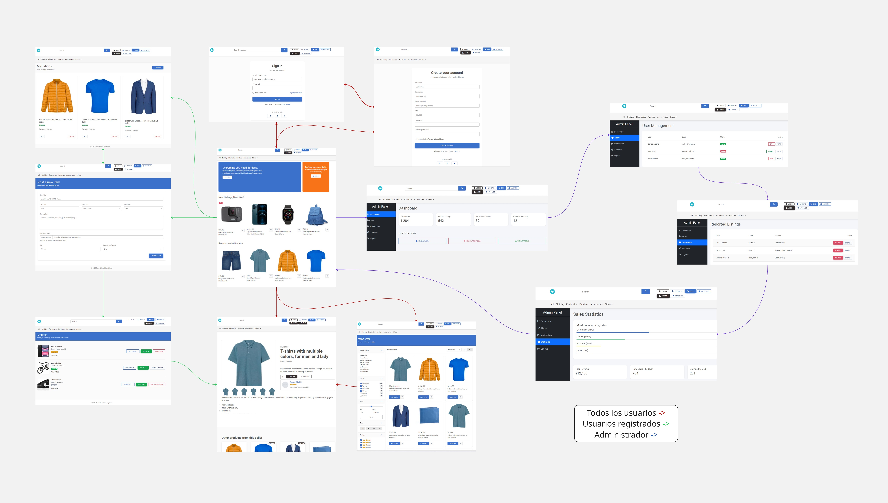

> [Descripción opcional del flujo de navegación: Ej: "El usuario puede acceder desde la página principal a todas las secciones mediante el menú de navegación. Los usuarios anónimos solo tienen acceso a las páginas públicas, mientras que los registrados pueden acceder a su perfil y panel de usuario."]

### **Capturas de Pantalla y Descripción de Páginas**

#### **1. Página Principal / Main**
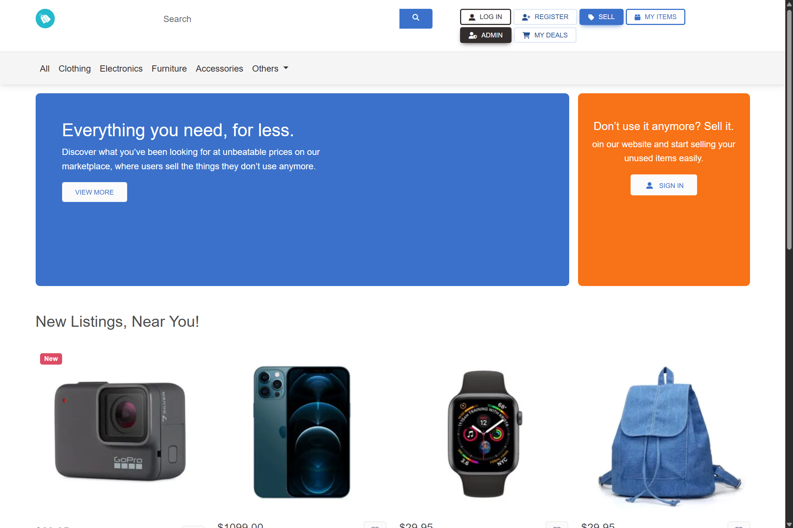

> Se trata de la página principal de la web de compra y venta de segunda mano. posee un encabezado  con diferentes opciones, como una barra de búsqueda, icono de la web para ir a esta misma página, asi como diferentes opciones que solo aparecerán dependiendo del tipo de usuario que sea, como por ejemplo en el botón de administrador, que solo será visible cuando un usuario registrado sea administrador.
Este encabezado estará presente en todas las ventanas de la web, manteniendo la cohesión de la misma y dejando la función de buscar productos siempre activa.
En la página  principal, aparecerán unos anuncios sobre la pagina, instando al usuario tanto a probarla como a crear una cuenta para conseguir nuevos vendedores.
Mas abajo, aparecerá un listado con productos mas recientes añadidos que podrían interesar al usuario. Sin el usuario no esta registrado, esta opción no aparecerá, puesto que no se tendrían los datos del usuario, sino que se agrandaría la sección de recomendaciones  para ocupar el espacio.
Abajo de esta, aparecerá la sección de recomendados para el usuario que si basara en:
>- Si el usuario esta registrado, se le recomendará productos relacionados con sus ultimas compras.
>- Si no esta registrado, las recomendaciones se basarán en los productos más vendidos gracias a las métricas recopiladas de los administradores.
>La página se rellenara hacia abajo con productos recomendados basado en lo mas vendido, siendo si esta registrado productos que le puedan interesar y si no lo esta con productos populares.

#### **2. Inicio de Sesión / Login**
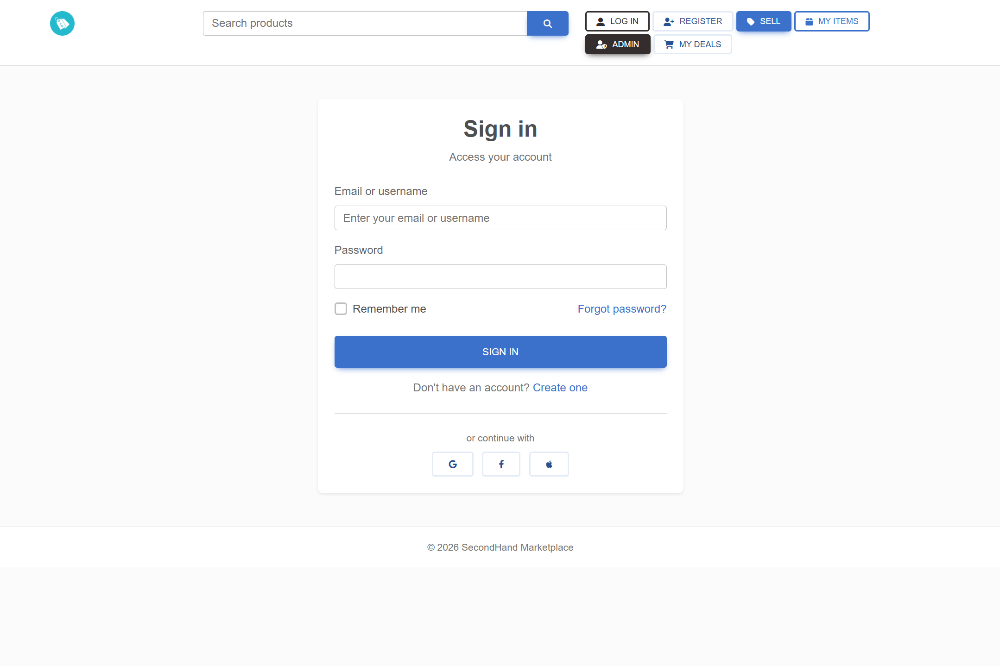

> Esta es la página HTML encargada del inicio de sesión de los usuarios registrados. Es una página básica, la cual comprueba el nombre de usuario o email y la contraseña para saber si la cuenta esta registrada y es correcta, dando también la opción de recuperar contraseña en caso de que sea necesario. También da la opción de crear una cuenta en caso de no tenerla. La página mantiene el estilo del resto de páginas, manteniendo el encabezado como en el resto de páginas. Una vez el usuario inicie sesión, esta ventana no aparecerá hasta que cierre sesión.

#### **3. Busqueda por categoría/ Category_Search**
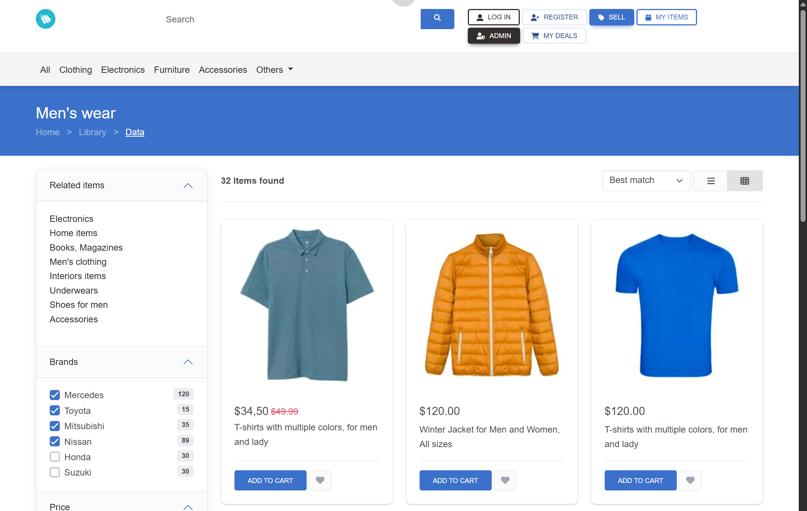

> La pagina es la encargada de mostrar los ítems cuando se busca por cagerías. La página será al final la misma que la página que muestra por búsqueda en la barra, pero se vera ligeramente diferenciada, ya que aquí se mostrará los productos específicos de la categoría que el usuario haya mostrado, asi como una lista de opciones a la izquierda de la página que el usuario podrá ajustar a sus necesidades. Se mantiene el encabezado de la página, manteniendo la cohesión con el resto de página.

#### **4. Página de administrador/ Administrator**
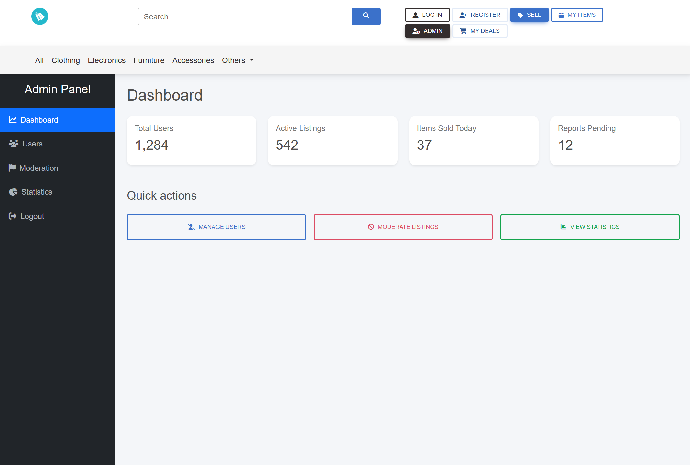

>La pagina de administrador es la pagina de control de la web. Esta página es solo accesible para usuarios que son administradores de la tienda, dejándoles monitorizar el estado de la tienda en todo momento.
Nada más entrar en la zona de administrador, la página muestra un dashboard con diferentes datos de la web, como los usuarios, pedidos, ítems vendidos o reportes. Debajo de esto hay una lista de acciones rápidas para el administrador
A su vez, en la parte izquierda de la pagina, se puede ver un panel de administrador que te deja acceder a las diferentes características que puede usar el administrador:
>- Users: para ver usuarios de la aplicación, y banearlos en caso de que sea necesario.
>- Moderation: reportes de moderación de la web.
>- Statistics: muestra las principales estadísticas de la página.

#### **5. Gestion de Usuarios/ Admin_users**
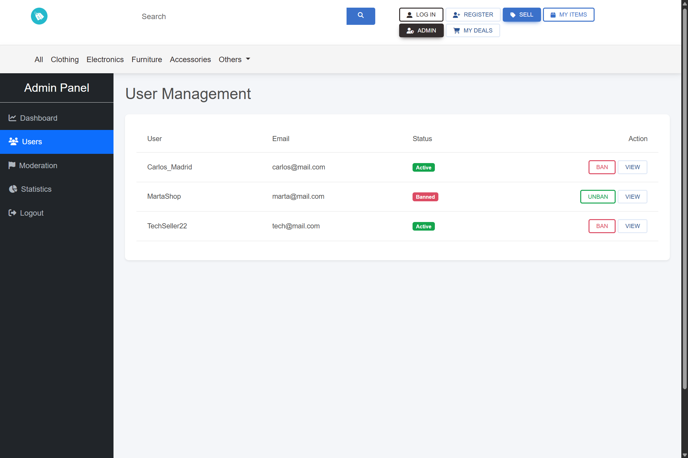

>Esta pagina muestra una lista de los usuarios registrados de la pagina web, asi como su estado dentro de la misma, el nombre y el correo. En caso de que sea necesario, se pueden tomar acciones como un baneo del usuario, asi como accedera al perfil del mismo.

#### **6.Moderación/ Admin_listings**
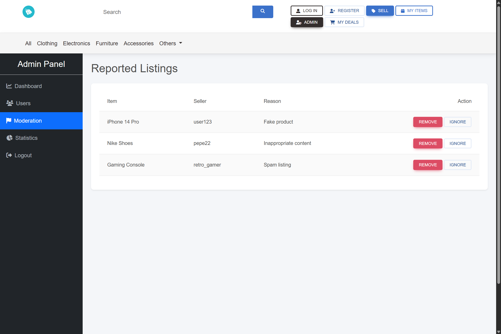

>Esta página de administrador trata sobre reportes de usuario para su moderación. En este caso es un listado con los diferentes reportes de usuarios sobre posibles productos fráudenlos de diferentes vendedores, y actuar en consecuencia, baneando en caso de que sea necesario, y quitando el producto fraudulento de la tienda.

#### **7.Estadisticas de la página/ Admin_stats**
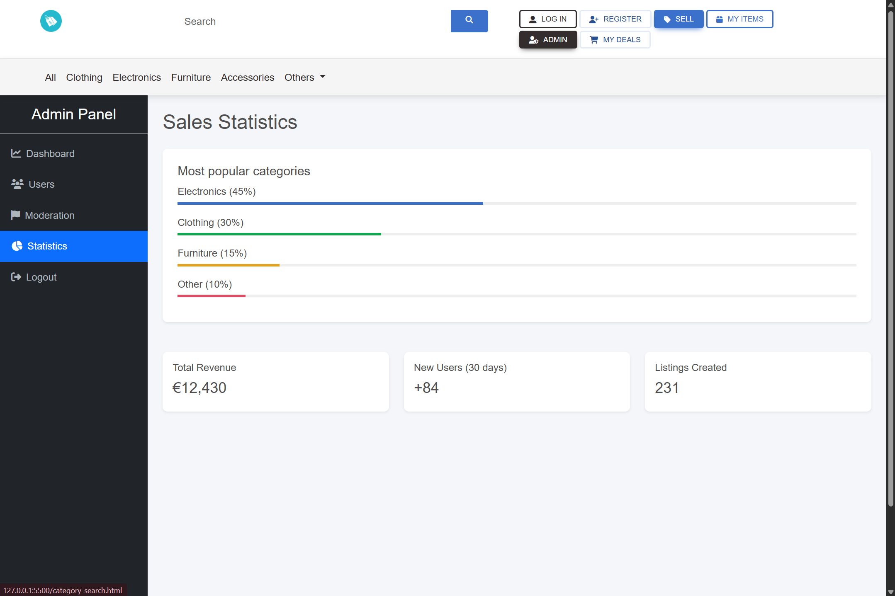

>Esta página muestra las diferentes estadísticas de ventas de la páginas, asi como otras estadísticas varias. Esto sirve a los administradores para saber que esta funcionando mejor en las ventas, asi como estadictas sobre nuevos usuarios o listas de pepidos creadas en los últimos días.

#### **8.Productos en interés/ my_deals**
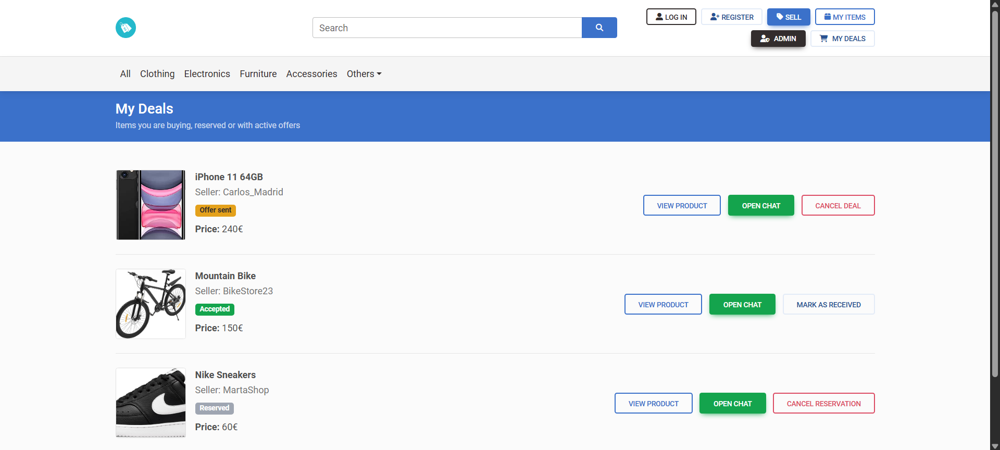

>Esta página muestra todos los artículos en los que tienes interés de cualquier tipo, ya sea interés en comprar, interés en reservarlo para lanzar una futura oferta o bien artículos en los que ya tienes una oferta realizada activa. Como podemos ver tenemos las opciones de abrir chat con el vendedor para cualquier duda y también se muestra de forma simple toda la información de relevancia de cada artículo (Estado del pedido, vendedor, fotos, precio, etc).

#### **9.Artículos en venta/ my_listings**
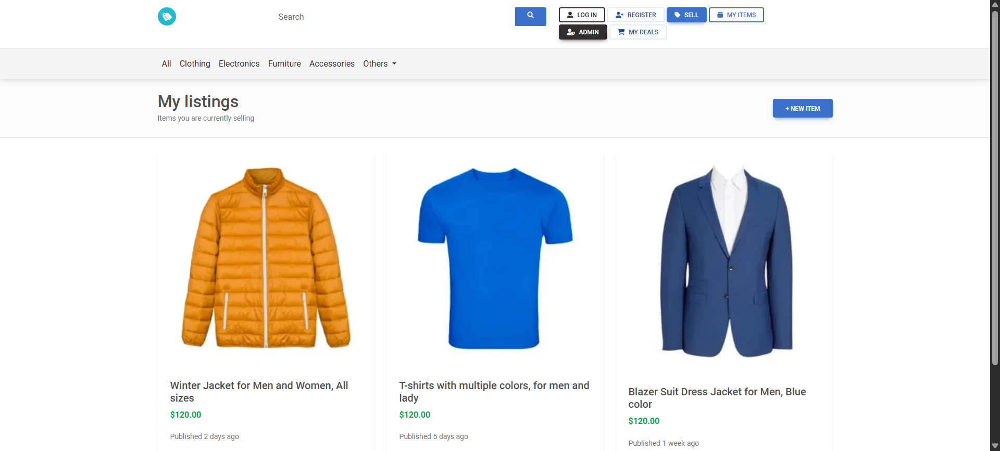

>Esta página muestra los artículos que un usuario tiene en venta, y tendrá la opción de poner otro artículo a la venta. También se muestra una pequeña previsualización de cada artículo con su precio y la fecha en la que se publicó.

#### **10.Búsqueda de artículos/ normal_search**
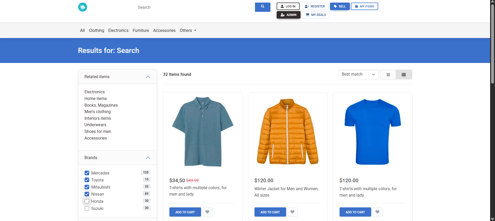

>Esta página muestra un buscador completo para los artículos que se encuentren en venta dentro de la web. En ella podemos diferenciar las diferentes previsualizaciones de los artículos, un menú lateral con tags que a futuro tendrá cada item, y también por supuesto la opción de añadir al carrito y de añadir a favoritos.

#### **11.Producto/ product**
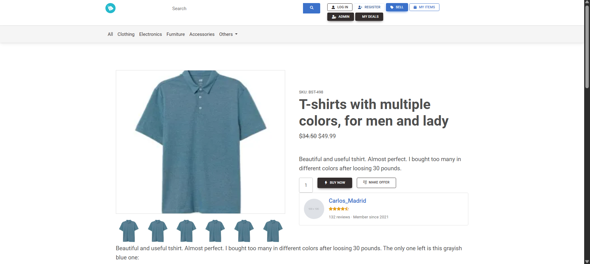

>En esta página nos encontramos la página dedicada a cada producto, en la cual podemos diferenciar que se pueden visualizar diferentes imágenes para las diferentes perspectivas posibles, una descripción breve del producto, el precio y el vendedor. Por supuesto también se podrá realizar una oferta o directamente comprar el producto.

#### **12.Publicar un nuevo producto/ publish**
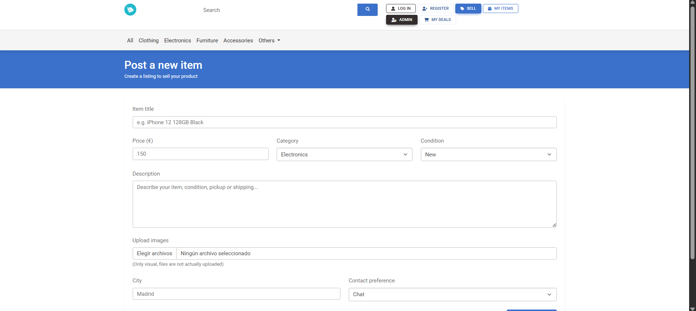

>Esta página muestra el cuestionario a rellenar para publicar un nuevo producto. En él podemos ver que se nos pide el nombre del artículo, el precio, la categoría (tag) y la condición, por si tiene algún defecto. También se nos pide una breve descripción y por último las imágenes a mostrar, la ciudad desde la que se vende y la preferencia de contacto.

#### **13.Registro/ register**
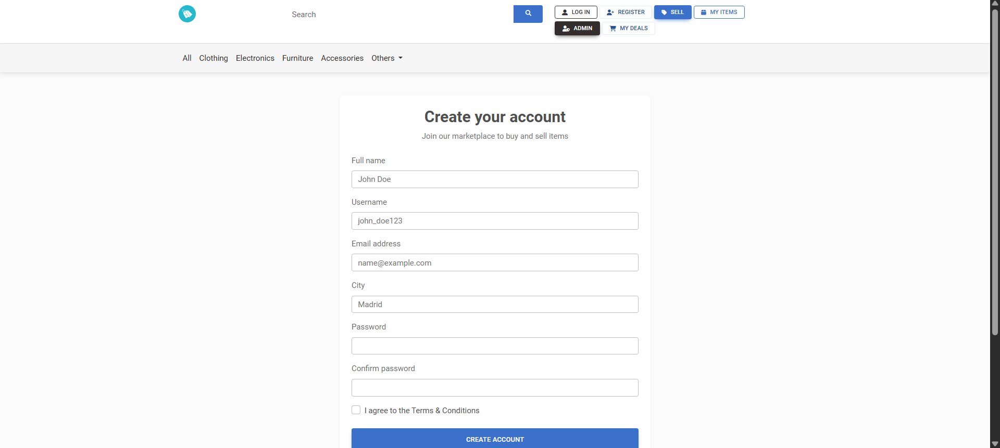

>Esta página muestra el formulario para crear una cuenta en el portal. Se pide el nombre completo, un nickname, el correo, la ciudad, una contraseña y también un apartado para confirmar la contraseña. Por último también hay un check para aceptar los términos y condiciones de la web.

#### **14.Cuenta de usuario/ user_account**
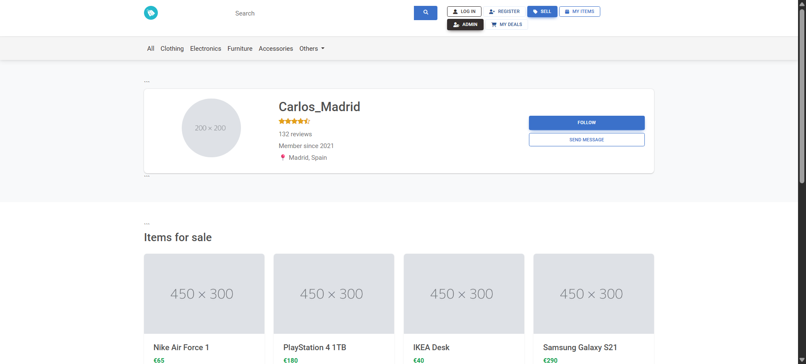

>Esta página muestra la página de perfil. En ella se puede ver los artículos que cada usuario tiene en venta y también un apartado para seguir a ese vendedor. También se ve la ciudad, desde cuando se unió a la página web, las estrellas en forma de valoración que posee el vendedor y el número de reseñas que tiene. Por último también se tiene la posibilidad de mandar un mensaje por chat al vendedor mediante el botón send message.

---

## 🛠 **Práctica 1: Web con HTML generado en servidor y AJAX**

### **Vídeo de Demostración**
📹 **[Enlace al vídeo en YouTube](https://youtu.be/T_p0byu14zw)**
> Vídeo mostrando las principales funcionalidades de la aplicación web.

### **Navegación y Capturas de Pantalla**

#### **Diagrama de Navegación**

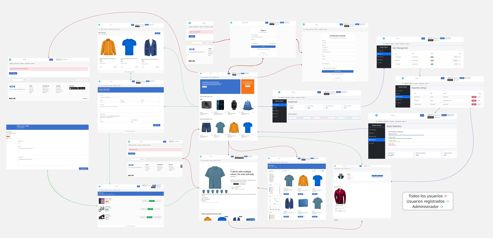
Porque se han añadido pantallas

#### **Capturas de Pantalla Actualizadas**

Han cambiado principalmente en como se ven porque ahora tienen datos, aunque se han añadido unas pocas.

##### **15. Formulario de Valoraciones / Rating Form**
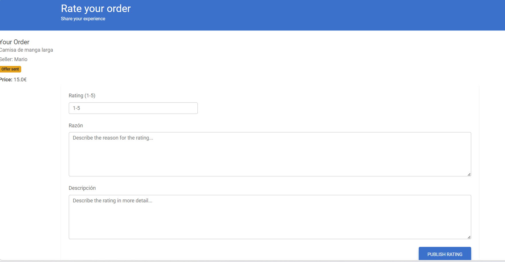

>Esta página muestra el formulario de las valoraciones, para valorar pedidos. En ella aparece, primero, datos del pedido, y luego, un formulario para evaluar el pedido del 1 al 5 y explicar el porqué.

##### **16. Pagina de Error del Login / Login Error Page**
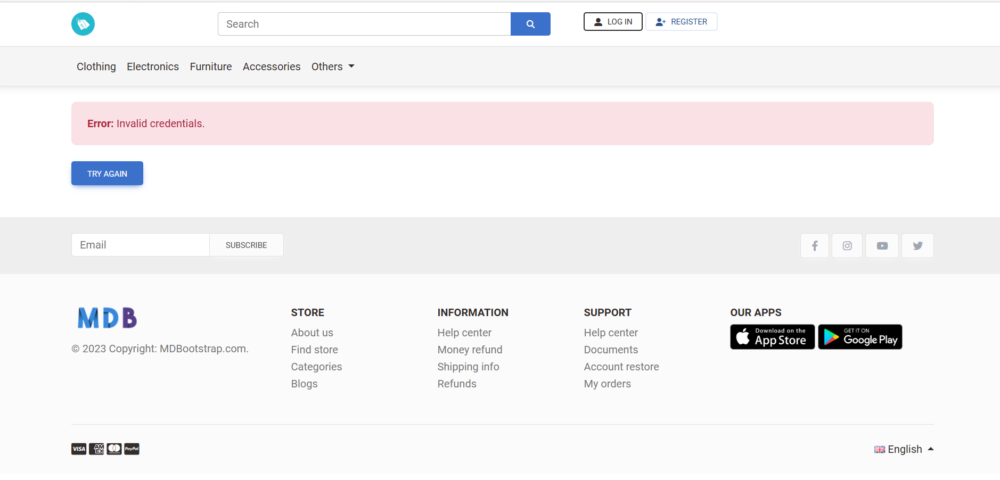

>Esta página muestra el error de login por credenciales invalidas, ya sea por el nombre de usuario, la contraseña o ambos. Además te permite volver al login para insertar tus datos adecuadamente.

##### **17. Pagina de Error al Buscar Página /  Page Error Page**
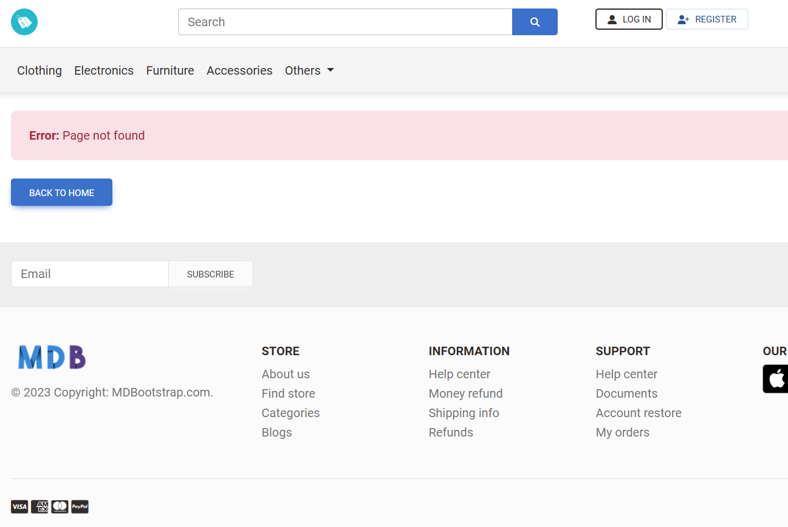

>Esta página muestra el error al buscar otra que no está, ya sea por que aún no se ha implementado o porque se ha escrito erroneamente la URI. Además te permite volver a la página principal.

##### **18. Pagina de Error General / Error Page**
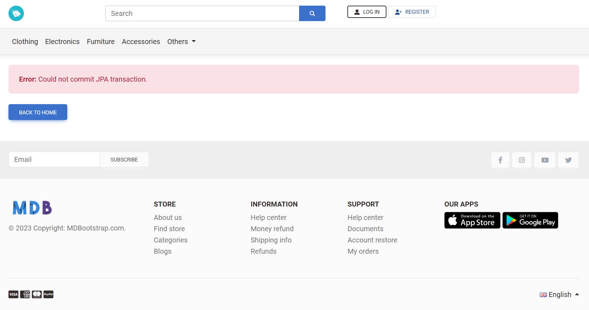

>Esta página muestra el error con su mensaje, de tenerlo. Si no tiene mensage, te dice que el error es desconocido. Además te permite volver a la página principal. En este caso el mensaje es que no se puede conectar por el jpa.

### **Instrucciones de Ejecución**

#### **Requisitos Previos**
- **Java**: versión 21 o superior
- **Maven**: versión 3.8 o superior
- **MySQL**: versión 8.0 o superior
- **Git**: para clonar el repositorio

#### **Pasos para ejecutar la aplicación**

1. **Clonar el repositorio**
   ```bash
   git clone https://github.com/[usuario]/[nombre-repositorio].git
   cd [nombre-repositorio]
   ```

2. **Crear una base de datos donde guardar los datos**
   2.1 **Conectarse al servidor SQL**
   ```bash
   mysql -u root -p
   ```
   2.2 **Crear bade de datos ladob**
   ```sql
   CREATE DATABASE empresa
    CHARACTER SET utf8mb4
    COLLATE utf8mb4_unicode_ci;
   ```
   2.3 **Configurar perfil**
   ```sql
   ALTER USER 'root'@'localhost' IDENTIFIED BY 'Th1$1$MyP@$$W0Rd';
   FLUSH PRIVILEGES;
   ```
4. **Instalar las dependencias**
   ```bash
   mvn install
   ```
5. **Correr la aplicación**
   ``` bash
   mvn spring-boot:run
   ```

#### **Credenciales de prueba**
- **Usuario Admin**: usuario: `admin`, contraseña: `admin`
- **Usuario Registrado**: usuario: `user`, contraseña: `user`

### **Diagrama de Entidades de Base de Datos**

Diagrama mostrando las entidades, sus campos y relaciones:

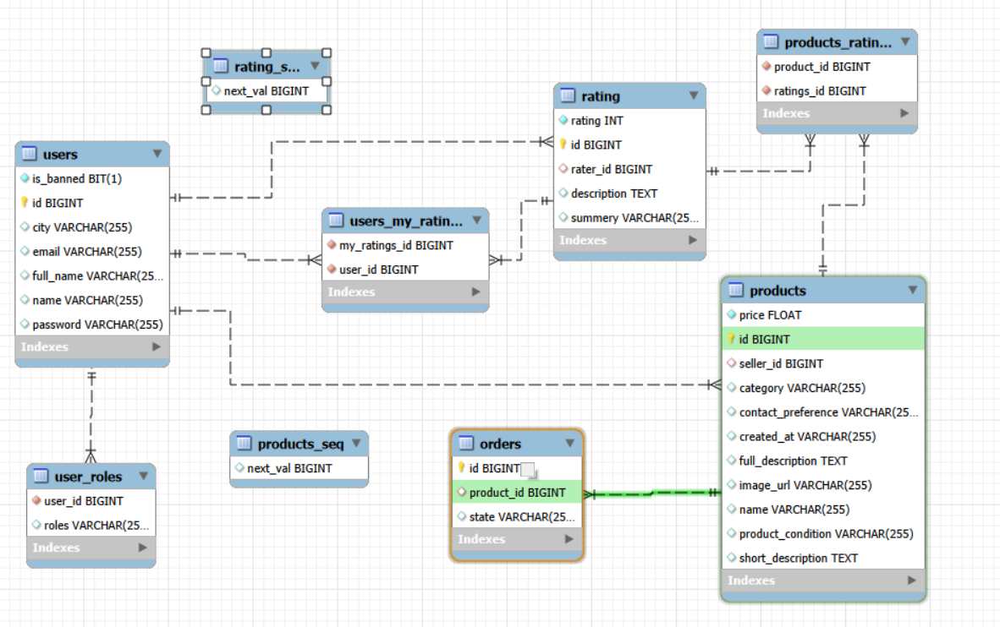

> [Descripción opcional: Ej: "El diagrama muestra las 4 entidades principales: Usuario, Producto, Pedido y Categoría, con sus respectivos atributos y relaciones 1:N y N:M."]

### **Diagrama de Clases y Templates**

Diagrama de clases de la aplicación con diferenciación por colores o secciones:

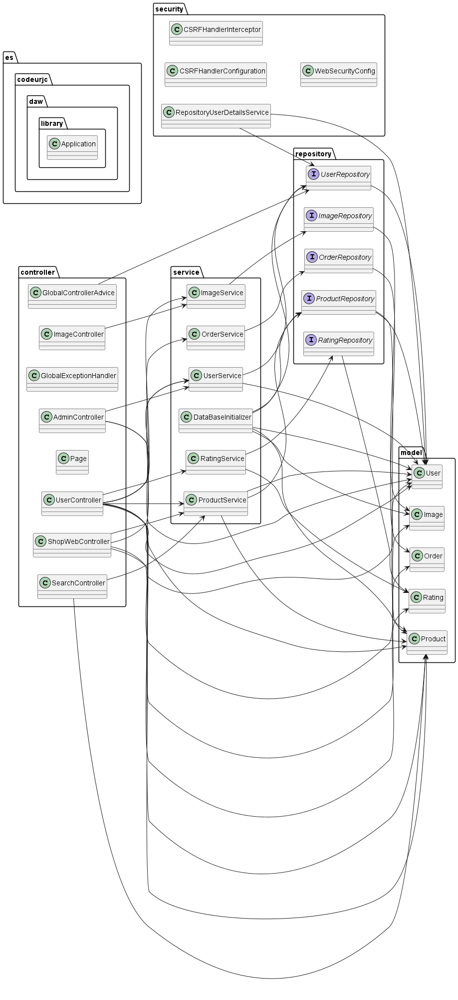

> [Descripción opcional del diagrama y relaciones principales]

### **Gráficos**
Indicar qué información se muestra usando gráficos y de qué tipo es:

- **Historico de productos**: Gráfico de líneas - Para admin
- **Cantidad de valoraciones**: Gráfico de tarta/circular - Para admin
- **Gráficos de categorías**: Gráfico de barras horizontales- Para admin
- **Historico de usuarios**: Gráfico de líneas - Para admin
- **Distribución de valoraciones de un vendedor**: Gráfico de barras horizontales -Para usuario, lo ven todos
- **Distribución de valoraciones en estrellas**: Gráfico de estrellas -Para usuario y producto, lo ven todos
  
### **Participación de Miembros en la Práctica 1**

#### **Alumno 1 - Sara Tuset Villoria**

Que la base de datos se conecte y se llene con datos preestablecidos.
Que las entidades se creen, borren y cambien.
Que las imagenes esten en la base de datos.
Que se paginen entidades con AJAX.
Login, signin y registro.
Readme.

| Nº    | Commits      | Files      |
|:------------: |:------------:| :------------:|
|1| [Creación y borrado imagenes](https://github.com/CodeURJC-DAW-2025-26/practica-daw-2025-26-grupo-14/commit/3e67f119ca50ebe06036515f8b5b97620aac6081)  | [Archivo1](URL_archivo_1)   |
|2| [Entidad valoraciones: editar, borrar y crear](https://github.com/CodeURJC-DAW-2025-26/practica-daw-2025-26-grupo-14/commit/f5da37df6fc99c3266cade92a33f81584b0ef4d3)  | [Archivo2](URL_archivo_2)   |
|3| [Paginación de productos con AJAX](https://github.com/CodeURJC-DAW-2025-26/practica-daw-2025-26-grupo-14/commit/bc80485bb6b9eab581306561ed78c798b0b52305)  | [Archivo3](URL_archivo_3)   |
|4| [Que puedas entrar al perfil](https://github.com/CodeURJC-DAW-2025-26/practica-daw-2025-26-grupo-14/commit/6622117e3e0e91461e2d1ab4c01e47de07699444)  | [Archivo4](URL_archivo_4)   |
|5| [Carga automatica en bases de datos](https://github.com/CodeURJC-DAW-2025-26/practica-daw-2025-26-grupo-14/commit/a04a3d25e4c65a09e4fcd7655323dc9c913dc6ba)  | [Archivo5](URL_archivo_5)   |

---

#### **Alumno 2 - Alejandro Triguero Ruiz**

Generalmente acciones de front y validaciones de back.

| Nº    | Commits      | Files      |
|:------------: |:------------:| :------------:|
|1| [Volver el campo ciudad una lista al crear usuario](https://github.com/CodeURJC-DAW-2025-26/practica-daw-2025-26-grupo-14/commit/681872e45cba02001c237189d84d8669ba3b612e)  | [Archivo1](URL_archivo_1)   |
|2| [Validacion de User](https://github.com/CodeURJC-DAW-2025-26/practica-daw-2025-26-grupo-14/commit/0d4d87f9ccdb7ad3df5089a4782e203f9d2e80cd)  | [Archivo2](URL_archivo_2)   |
|3| [Arreglos variados](https://github.com/CodeURJC-DAW-2025-26/practica-daw-2025-26-grupo-14/commit/c63a82ec2711062200055c52b8d656235b50e8a1)  | [Archivo3](URL_archivo_3)   |
|4| [Footer y header separados](https://github.com/CodeURJC-DAW-2025-26/practica-daw-2025-26-grupo-14/commit/98014486bb11b9a05f2526162f9dd23bd43e56f3)  | [Archivo4](URL_archivo_4)   |
|5| [Busqueda por nombre operativa](https://github.com/CodeURJC-DAW-2025-26/practica-daw-2025-26-grupo-14/commit/7bc710613f232183c3824f0cebccaa0cda6553e4)  | [Archivo5](URL_archivo_5)   |

---

#### **Alumno 3 - Sergio Villagarcía Sánchez**

Que se pueda acceder de forma segura y cambios menores de front.

| Nº    | Commits      | Files      |
|:------------: |:------------:| :------------:|
|1| [Merge cargando commits](https://github.com/CodeURJC-DAW-2025-26/practica-daw-2025-26-grupo-14/commit/7fbb1142a2071e8bc336649198d0aae8d94c85f9)  | [Archivo1](URL_archivo_1)   |
|2| [Poder acceder con https](https://github.com/CodeURJC-DAW-2025-26/practica-daw-2025-26-grupo-14/commit/71105440a9ccd7236ddba0e8bd3d4ad5f5466999)  | [Archivo2](URL_archivo_2)   |
|3| [Cambiar titulos de páginas](https://github.com/CodeURJC-DAW-2025-26/practica-daw-2025-26-grupo-14/commit/3bcb7d202177940b48fb08bb22bfec642e0d3958)  | [Archivo3](URL_archivo_3)   |
|4| [Cambiar titulo de página main](https://github.com/CodeURJC-DAW-2025-26/practica-daw-2025-26-grupo-14/commit/29703a55dd65c14fc8347b57c69deb78525ca820)  | [Archivo3](URL_archivo_3)   |

---

## 🛠 **Práctica 2: Incorporación de una API REST a la aplicación web, despliegue con Docker y despliegue remoto**

### **Uso Trello**
**[Enlace a nuestro Trello](https://trello.com/b/VIU1FiGj/practica-2)**
> Hemos usado Trello para organizarnos mejor.

### **Vídeo de Demostración**
📹 **[Enlace al vídeo en YouTube](https://youtu.be/zMVI2Rk2z_8)**
> Vídeo mostrando las principales funcionalidades de la aplicación web.

### **Documentación de la API REST**

#### **Especificación OpenAPI**
📄 **[Especificación OpenAPI (YAML)](/api-docs/api-docs.yaml)**

#### **Documentación HTML**
📖 **[Documentación API REST (HTML)](https://raw.githack.com/[usuario]/[repositorio]/main/api-docs/api-docs.html)**

> La documentación de la API REST se encuentra en la carpeta `/api-docs` del repositorio. Se ha generado automáticamente con SpringDoc a partir de las anotaciones en el código Java.

### **Diagrama de Clases y Templates Actualizado**

Diagrama actualizado incluyendo los @RestController y su relación con los @Service compartidos:

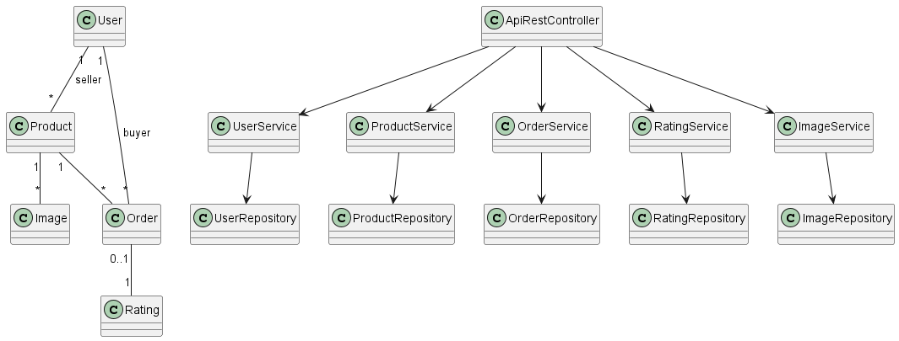

### **Instrucciones de Ejecución con Docker**

#### **Requisitos previos:**
- Docker instalado (versión 20.10 o superior)
- Docker Compose instalado (versión 2.0 o superior)

#### **Pasos para ejecutar con docker-compose:**

1. **Clonar el repositorio** (si no lo has hecho ya):
   ```bash
   git clone https://github.com/[usuario]/[repositorio].git
   cd [repositorio]
   ```

2. **Crear la imagen**:
   Explicado justo debajo.
   
3. **Lanzar el Docker Compose**:
    ```bash
   docker compose up
   ```

### **Construcción de la Imagen Docker**

#### **Requisitos:**
- Docker instalado en el sistema

#### **Pasos para construir y publicar la imagen:**

1. **Navegar al directorio de Docker**:
   ```bash
   cd docker
   ```

2. **Crear la imagen** 
   ```bash
     powershell -File build-and-run.ps1
   ```

### **Despliegue en Máquina Virtual**

#### **Requisitos:**
- Acceso a la máquina virtual (SSH)
- Clave privada para autenticación
- Conexión a la red correspondiente o VPN configurada

#### **Pasos para desplegar:**

1.  **Conectar a la máquina virtual**:
   ```bash
   ssh -i [ruta/a/clave.key] [usuario]@[IP-o-dominio-VM]
   ```
   
   Ejemplo:
   ```bash
   ssh -i ./ssh-keys/appWeb14.key vmuser@10.100.139.125
   ```
2. **Clonar la carpeta en maquina virtual**:
   ```bash
   git clone https://github.com/CodeURJC-DAW-2025-26/practica-daw-2025-26-grupo-14
   ```
3. **Descargar docker una vez dentro**:
   ```bash
   sudo docker install
   ```
4. **Ir a la carpeta adecuada**:
   ```bash
   cd /home/[usuario]/practica-daw-2025-26-grupo-14
   ```
   Ejemplo:
   ```bash
   cd /home/vmuser/practica-daw-2025-26-grupo-14
   ```
5. **Crear imagen**:
   ```bash
   sudo docker build -t ladob-api:latest -f docker/Dockerfile .
   ```
6. **Crear imagen con compose**:
    ```bash
   sudo docker compose up --build
   ```

7. **Lanzar imagen**:
   ```bash
   sudo docker compose up
   ```
Da error con la base de datos al lanzarse así, dice que no existe la tabla USERS en la BBDD.

#### **Credenciales de Usuarios de Ejemplo**

| Rol | Usuario | Contraseña |
|:---|:---|:---|
| Administrador | admin | adminpass |
| Usuario Registrado | Mario | pass |
| Usuario Registrado | LuGar | pass |
| Usuario Registrado | Carlos | pass |

### **Participación de Miembros en la Práctica 2**

#### **Alumno 1 - [Sara Tuset Villoria]**

[Añadir apis, manejo de seguridad y el readme]

| Nº    | Commits      | Files      |
|:------------: |:------------:| :------------:|
|1| [Añadida Api](9ebf3affded21d1fe5a785f988b0e73b24acad8b)  | [Archivo1](URL_archivo_1)   |
|2| [Manejo de seguridad](b990d52e8d804a17e6939036b25dc61c261269dd)  | [Archivo2](URL_archivo_2)   |
|3| [Arreglos de seguridad](8a5a5efcd63a7cd2c0f4b1e86118143eb846c536)  | [Archivo3](URL_archivo_3)   |
|4| [Encargarme del readme](ae340705f7aaa69f2beb3c44f55122e96f820e68)  | [Archivo4](URL_archivo_4)   |
|5| [Añadir contenido](18c91b2dff21c9f8e6ac061b6f6a276b6f04fbae)  | [Archivo5](URL_archivo_5)   |

---

#### **Alumno 2 - [Alejandro Triguero Ruiz]**

[Añadir apis, manejo de seguridad, arreglo de errores y documentación]

| Nº    | Commits      | Files      |
|:------------: |:------------:| :------------:|
|1| [Configurar la seguridad](17e6a75b64b94185a74a59f33d9421612942c35f)  | [Archivo1](URL_archivo_1)   |
|2| [Añadir APIs](bf721ee49d6a01eca53921bc71bec936d5ff447e)  | [Archivo2](URL_archivo_2)   |
|3| [Colección de Postman](cf879870d631f20802c2a1f087b8cac6762d4395)  | [Archivo3](URL_archivo_3)   |
|4| [Arreglo de errores](2ccede8865ef1f2a0ea776cad55c2305e2b5ac96)  | [Archivo4](URL_archivo_4)   |
|5| [Rematar carpeta docker](824e233b184e8a107fcf35d30d3f3be37b616533)  | [Archivo5](URL_archivo_5)   |

---

#### **Alumno 3 - [Sergio Villagarcía Sánchez]**

[Paginación, endpoints y docker]

| Nº    | Commits      | Files      |
|:------------: |:------------:| :------------:|
|1| [Añadir paginación](0916ff3edb49d3ad266769073603750c08be140d)  | [Archivo1](URL_archivo_1)   |
|2| [Manejar control del usuario](0916ff3edb49d3ad266769073603750c08be140d)  | [Archivo2](URL_archivo_2)   |
|3| [Automatización de docker](86d39ed2478c8e0f7315f851144baad4897a41c6)  | [Archivo3](URL_archivo_3)   |

---


## 🛠 **Práctica 3: Implementación de la web con arquitectura SPA**

### **Vídeo de Demostración**
📹 **[Enlace al vídeo en YouTube](URL_del_video)**
> Vídeo mostrando las principales funcionalidades de la aplicación web.

### **Preparación del Entorno de Desarrollo**

#### **Requisitos Previos**
- **Node.js**: versión 18.x o superior
- **npm**: versión 9.x o superior (se instala con Node.js)
- **Git**: para clonar el repositorio

#### **Pasos para configurar el entorno de desarrollo**

1. **Instalar Node.js y npm**
   
   Descarga e instala Node.js desde [https://nodejs.org/](https://nodejs.org/)
   
   Verifica la instalación:
   ```bash
   node --version
   npm --version
   ```

2. **Clonar el repositorio** (si no lo has hecho ya)
   ```bash
   git clone https://github.com/[usuario]/[nombre-repositorio].git
   cd [nombre-repositorio]
   ```

3. **Navegar a la carpeta del proyecto React**
   ```bash
   cd frontend
   ```

4. **AQUÍ LOS SIGUIENTES PASOS**

### **Diagrama de Clases y Templates de la SPA**

Diagrama mostrando los componentes React, hooks personalizados, servicios y sus relaciones:

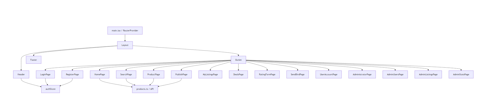

### **Participación de Miembros en la Práctica 3**

#### **Alumno 1 - [Nombre Completo]**

[Descripción de las tareas y responsabilidades principales del alumno en el proyecto]

| Nº    | Commits      | Files      |
|:------------: |:------------:| :------------:|
|1| [Descripción commit 1](URL_commit_1)  | [Archivo1](URL_archivo_1)   |
|2| [Descripción commit 2](URL_commit_2)  | [Archivo2](URL_archivo_2)   |
|3| [Descripción commit 3](URL_commit_3)  | [Archivo3](URL_archivo_3)   |
|4| [Descripción commit 4](URL_commit_4)  | [Archivo4](URL_archivo_4)   |
|5| [Descripción commit 5](URL_commit_5)  | [Archivo5](URL_archivo_5)   |

---

#### **Alumno 2 - [Nombre Completo]**

[Descripción de las tareas y responsabilidades principales del alumno en el proyecto]

| Nº    | Commits      | Files      |
|:------------: |:------------:| :------------:|
|1| [Descripción commit 1](URL_commit_1)  | [Archivo1](URL_archivo_1)   |
|2| [Descripción commit 2](URL_commit_2)  | [Archivo2](URL_archivo_2)   |
|3| [Descripción commit 3](URL_commit_3)  | [Archivo3](URL_archivo_3)   |
|4| [Descripción commit 4](URL_commit_4)  | [Archivo4](URL_archivo_4)   |
|5| [Descripción commit 5](URL_commit_5)  | [Archivo5](URL_archivo_5)   |

---

#### **Alumno 3 - [Nombre Completo]**

[Descripción de las tareas y responsabilidades principales del alumno en el proyecto]

| Nº    | Commits      | Files      |
|:------------: |:------------:| :------------:|
|1| [Descripción commit 1](URL_commit_1)  | [Archivo1](URL_archivo_1)   |
|2| [Descripción commit 2](URL_commit_2)  | [Archivo2](URL_archivo_2)   |
|3| [Descripción commit 3](URL_commit_3)  | [Archivo3](URL_archivo_3)   |
|4| [Descripción commit 4](URL_commit_4)  | [Archivo4](URL_archivo_4)   |
|5| [Descripción commit 5](URL_commit_5)  | [Archivo5](URL_archivo_5)   |

---

#### **Alumno 4 - [Nombre Completo]**

[Descripción de las tareas y responsabilidades principales del alumno en el proyecto]

| Nº    | Commits      | Files      |
|:------------: |:------------:| :------------:|
|1| [Descripción commit 1](URL_commit_1)  | [Archivo1](URL_archivo_1)   |
|2| [Descripción commit 2](URL_commit_2)  | [Archivo2](URL_archivo_2)   |
|3| [Descripción commit 3](URL_commit_3)  | [Archivo3](URL_archivo_3)   |
|4| [Descripción commit 4](URL_commit_4)  | [Archivo4](URL_archivo_4)   |
|5| [Descripción commit 5](URL_commit_5)  | [Archivo5](URL_archivo_5)   |

